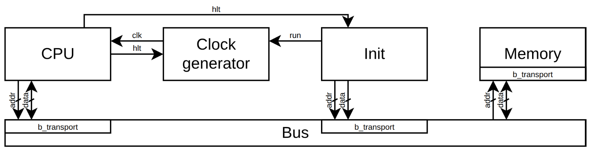

# Зависимости

- [SystemC 2.3.4 (Includes TLM)](https://www.accellera.org/downloads/standards/systemc)

# Запуск

```
    export SYSTEMC_HOME='<path for systemc>'
    make
    ./main
```

# Описание



1. Генератор тактовых импульсов выключен. Модуль инициализации (Init) загружает программу в память, используя метод b_transport. Затем происходит сброс процессора (CPU.rst = 1, CPU.state = State::Init).
2. Init устанавливает адрес начала программы на шину данных (CPU.busDataInPC) и запускает генератор тактовых импульсов (Clock_generator.run).
3. CPU считывает значение с шины данных (CPU.busDataInPC) и сохраняет его в счетчик команд (PC - program counter), после чего переходит в режим выборки инструкции (CPU.state = State::instrFetch).
4. Состояние процессора циклически меняется от instrFetch к Execute и обратно, пока не встретится команда HLT.
5. При выполнении команды HLT процессор переходит в состояние остановки (CPU.state = State::HLT), посылает сигнал остановки (CPU.hlt = 1). Генератор тактовых импульсов останавливается, если clock_generator.run != 1. Модуль инициализации (Init) завершает симуляцию при сигнале CPU.hlt = 1.

# Выводы 

1. Подход разработки сверху вниз позволил бы получить готовую модель быстрее. Также он позволил бы создать регрессионное тестирование на ранних этапах, что упростило бы написание более детальной модели.
2. В CPU реализован поток bus_thread, который является адаптером для низкоуровневого интерфейса CPU и TLM интерфейса шины, что не является лучшим решением. Полагаю, следует реализовать это отдельным классом. Текущее решение приводит к созданию BusDataOut, BusDataIn, BusDataInPC, что нарушает принцип единственной ответственности.
